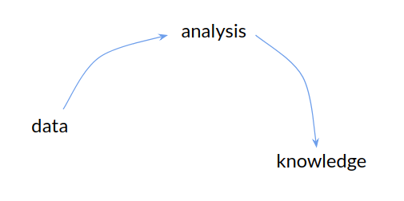
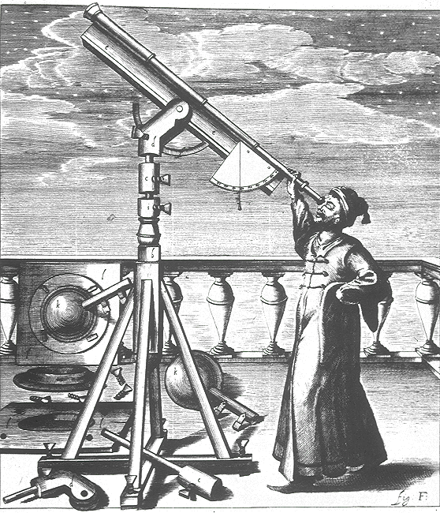
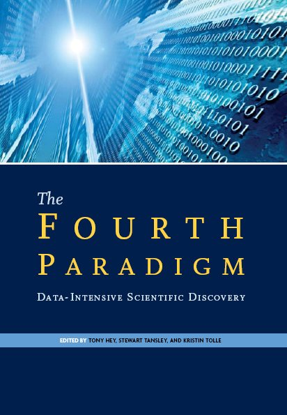
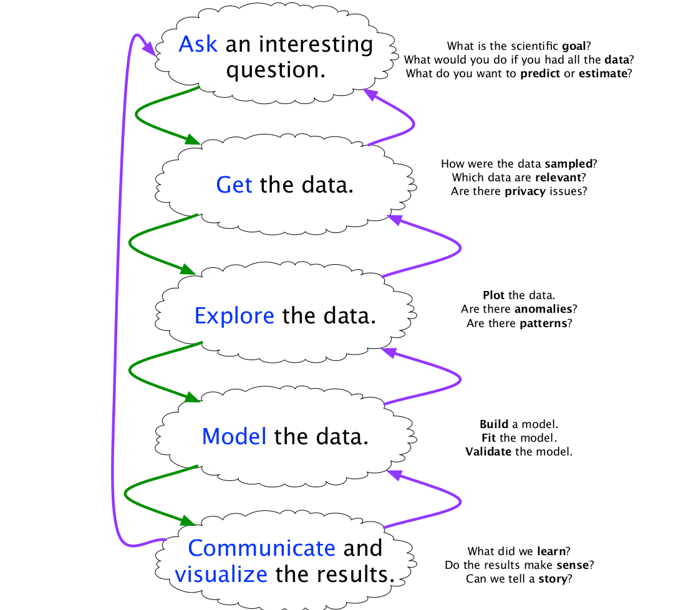

class: middle, center, title-slide

# Big data project

Kick-off

  
Profs. Gilles Louppe, Bertrand Cornélusse and Pierre Geurts

---

class: middle

# The data science era

---

class: middle, center

Big data? Data science?

.width-70[]

???

- Who is in the master in data science?
- Can you define big data or data science?

---

class: middle

.italic["A data scientist is someone who knows more
statistics than a computer scientist and more
computer science than a statistician."]
 
.pull-right[Josh Blumenstock]

---

class: middle

.italic["Data scientist = statistician + programmer + coach + storyteller + artist"]
  
.pull-right[Shlomo Aragmon]

---

class: center, middle

.width-80[]

???

- Subject expertise includes business expertise.
- Hacking + Domain expertise = danger zone. The absence of rigorous methods can beget incorrect analysis.
- There are few unicorns. Hence training in data science.

---

class: center, middle

.width-80[]
.caption[Nate Silver]

???

Nate Silver successfully called the outcomes in 49 of the 50 states in the 2008 US Presidential election.

---

class: center, middle

.width-80[]
.caption["Nate Silver won the election" - Harvard Business Review]

---

class: middle, center

???

Also, from knowledge back to data.

---

class: middle, center

.width-50[]

.caption[Haven't we be doing data analysis forever?]

???

Yes! So, what's new?

---

class: middle

.circle.center.width-40[]

.italic["Every two days now we create as much information as we did from the dawn of civilization up until  2003, according to Schmidt. That’s something like five exabytes of data, he says.

Let me repeat that: we create as much information in two days now as we did from the dawn of man through 2003.]

.pull-right[Eric Schmidt, **2010**.]

---

class: middle, center, black-slide

.width-80[]

???

- 1 zettabyte = 1 trillion gigabytes
- 1 followed by 21 zeroes

"75 billion fully-loaded 16 GB Apple iPads, which would fill the entire area of Wembley Stadium to the brim 41 times, the Mont Blanc Tunnel 84 times, CERN's Large Hadron Collider tunnel 151 times, Beijing National Stadium 15.5 times or the Taipei 101 Tower 23 times."

"A full-length episode of FOX TV's hit series 24 running continuously for 125 million years."

---

class: middle, center

.width-100[]

---

class: middle

.grid[
.kol-1-2[.width-90[]]
.kol-1-2[
.italic[
 

“Increasingly, scientific breakthroughs will
be powered by advanced computing
capabilities that help researchers
manipulate and explore massive
datasets.

The speed at which any given scientific
discipline advances will depend on how
well its researchers *collaborate* with one
another, and with technologists, in areas
of eScience such as **databases**,
**workflow management**, visualization,
and **cloud computing technologies**.”
]
]
]

???

We came to the realization that...

---

class: middle

.italic["By 2018, the US could face a shortage of up to 190,000 workers with analytical skills."]
 
.pull-right[McKinsey Global Institute]

---

class: middle

.circle.center.width-40[]

.italic["The ability to take **data** – to be able to
*understand* it, to *process* it, to *extract
value* from it, to *visualize* it, to
*communicate* it's going to be a hugely
important skill in the next decades, not
only at the professional level but even at
the educational level for elementary school
kids, for high school kids, for college kids.
Because now we really do have essentially
free and ubiquitous data."]
.pull-right[Hal Varian, Chief Economist, Google]

---

# The data science pipeline

.center.width-80[]

---

class: middle

In practice, the data science process involves **several steps**:
- Understanding and formalizing the problem
- Defining a model
- Collecting, cleaning and storing data
- Choosing a technology
- Analyzing the results
- Storytelling and visualization
- Iterate

---

class: middle

## Understanding and formalizing

- What is it that I really want to answer?
- Why do I want an answer to this question?
- Do I understand the problem?

---

class: middle

## Defining a model

- How do I answer?
- What are my assumptions?
- What statistical model do I consider?
- What algorithm shall I use?

---

class: middle

## Collecting, cleaning and storing data

- What data do I need for fitting my model?
- How large this data should be?
- Where do I collect this data?
- Is data cleaning necessary?
- How do I store the data?

---

class: middle

## Choosing a technology

- What tools do I need?
- What technology shall I use?
- Is a laptop enough, or shall I use a large-scale distributed system?
- How do I make my analysis reproducible?

---

class: middle

## Analyzing the results

- How do I analyze the results of the model?
- How do I assess the significance of the results?
- To what do I compare?
- What are the conclusions?
- Is this convincing?
- Does this corroborate with previous studies or intuition?

---

class: middle

## Storytelling and visualization

- How do I present my results?
- How do I make interpretable visualizations?
- How do I present my results to a non-technical audience?
- How do I make my results and conclusions as simple as possible, but not simpler?

---

class: middle

## Iterate, iterate, iterate

- Is this conclusive?
- Am I going in the right direction?
- Shall I go back and define a new model?
- ... or collect new or more data?
- ... or use other tools?

---

class: middle

# Your project this year

(Pick one!)

---

class: middle, center, italic

Who will win the 2019 French Open?

---

class: middle, center, italic

Is global warming for real?

---

class: middle, center

xxx

---

class: middle

# Organization

---

# Instructors

This project is mentored by:
- Prof. Gilles Louppe ([g.louppe@uliege.be](mailto:g.louppe@uliege.be))
- Prof. Bertrand Cornélusse ([bertrand.cornelusse@uliege.be](mailto:bertrand.cornelusse@uliege.be))
- Prof. Pierre Geurts ([p.geurts@uliege.be](mailto:p.geurts@uliege.be))

Feel free to contact any of us for help!

 
.center[
.circle[] &nbsp;
.circle[] &nbsp;
.circle[]
]

---

# Materials

Slides and other materials are available at [github.com/glouppe/proj0016-big-data-project](https://github.com/glouppe/proj0016-big-data-project).

xxx image

.center.width-80[]

---

# Groups

The project is carried out in **groups of 3 students**.

The topic should be selected and the groups should be formed by October 8.
- Notify us by email.
- If you are alone, send us an email too!

---

# Reviews

We will meet on *every last Monday of the month* to review your progress.
- Oral presentation of your ongoing progress.
    - 10mn
    - Q&A
    - Everyone must present at least once
- Short report
    - 4 pages max
    - To be submitted on the Friday before the review day

The goal is to give you feedback on technical progress and project management.

---

# Seminars

The project is complemented by seminars by local and external speakers.
- Topics: big data, data science, visualization, communication, domain-specific presentations, etc.
- Presence at the seminars and intermediate reviews is **mandatory**.

---

# Final defense

The final deliverables of your project consist in:
- a final comprehensive report of your study
- a (public) oral defense

---

# Agenda

- 24/09/2018 (2PM) Kick-off
- 08/10/2018 Groups must be formed and the topic decided
- 29/10/2018 (2PM) Project review #1: Pre-analysis, literature review
- 26/11/2018 (2PM) Project review #2: Data collection #1
- 17/12/2018 (2PM) Project review #3: Data analysis #1
- 25/02/2019 (9AM) Project review #4: Data collection #2
- 25/03/2018 (9AM) Project review #5: Data analysis #2
- 29/04/2018 (9AM) Project review #6: Further improvements.
- 13/05/2018 (9AM) Project defense and final report

Seminars will be announced later.

---

# Evaluation

The evaluation will be based on:
- the intermediate review meetings (progress achieved, quality of project management) (*6x 5%*)
- the quality of the final report (*15%*)
- the quality of the final oral defense (*15%*)
- the overall study (*40%*)
    - the originality, methodology, clarity, reproducibility and technological choices of the solution will be mainly assessed.    

---

class: middle

# Brainstorming
