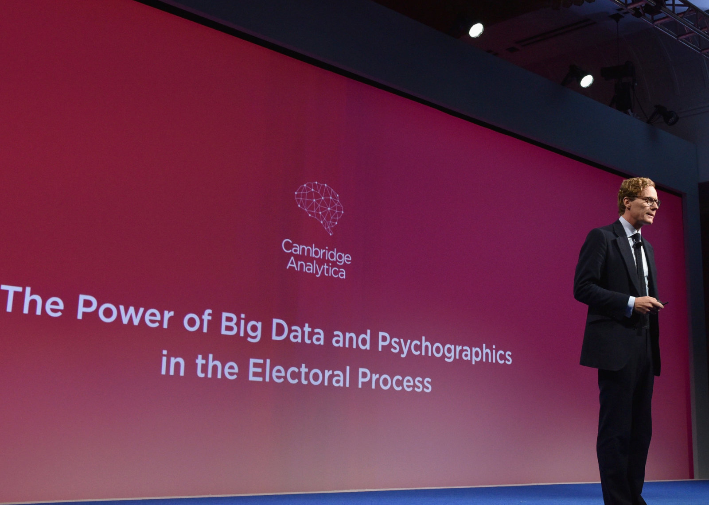

class: middle, center, title-slide

# Big data project

Kick-off

  
Profs. Bertrand Cornélusse, Pierre Geurts and Gilles Louppe

---

# Today

- What is data science?
- Solving data science problems
- Course and project organization

---

class: middle

# The data science era

---

class: middle, center, black-slide

.width-90[]

???

Can you define big data or data science?

---

class: middle

.circle.center.width-40[]

.italic["Every two days now we create as much information as we did from the dawn of civilization up until  2003, according to Schmidt. That’s something like five exabytes of data, he says.

Let me repeat that: we create as much information in two days now as we did from the dawn of man through 2003.]

.pull-right[Eric Schmidt, 2010.]

---

class: middle, center, black-slide

.width-100[]

???

- 1 zettabyte = 1 trillion gigabytes
- 1 followed by 21 zeroes

"75 billion fully-loaded 16 GB Apple iPads, which would fill the entire area of Wembley Stadium to the brim 41 times, the Mont Blanc Tunnel 84 times, CERN's Large Hadron Collider tunnel 151 times, Beijing National Stadium 15.5 times or the Taipei 101 Tower 23 times."

"A full-length episode of FOX TV's hit series 24 running continuously for 125 million years."

---

class: middle, center

.width-100[]

---

class: middle

.circle.center.width-40[]

.italic["The ability to take **data** – to be able to
*understand* it, to *process* it, to *extract
value* from it, to *visualize* it, to
*communicate* it's going to be a hugely
important skill in the next decades, not
only at the professional level but even at
the educational level for elementary school
kids, for high school kids, for college kids.
Because now we really do have essentially
free and ubiquitous data."]
.pull-right[Hal Varian, Chief Economist, Google]

---

class: middle

.italic["A data scientist is someone who knows more
statistics than a computer scientist and more
computer science than a statistician."]
 
.pull-right[Josh Blumenstock]

   

.italic["Data scientist = statistician + programmer + coach + storyteller + artist"]
  
.pull-right[Shlomo Aragmon]

---

class: center, middle

.width-80[]

???

- Subject expertise includes business expertise.
- Hacking + Domain expertise = danger zone. The absence of rigorous methods can beget incorrect analysis.
- There are few unicorns. Hence training in data science.

---

class: center, middle

.width-80[]
.caption[Nate Silver]

???

Nate Silver successfully called the outcomes in 49 of the 50 states in the 2008 US Presidential election.

---

class: center, middle

.width-80[]
.caption["Nate Silver won the election" - Harvard Business Review]

???

Mention visualization and communication skills.

---

class: center, middle

.width-60[]

.width-80[]

---

class: middle, center, black-slide

.grid[
.kol-2-3[.width-100[]]
.kol-1-3[.width-100[]]
]

---

class: middle

# Solving data science problems

---

class: middle

.center.width-90[]

.footnote[Image credits: [International Data Science in Schools Project](http://www.idssp.org/pages/datascience.html), 2018.]

???

Analogy with the scientific method.

---

class: middle

.center.width-90[]

.footnote[Image credits: [International Data Science in Schools Project](http://www.idssp.org/pages/datascience.html), 2018.]

---

class: middle

## Understanding and formulating the problem

- What is it that I really want to answer?
- Why do I want an answer to this question?
- Do I understand the problem?
- What is the hypothesis that I want to evaluate?

---

class: middle

## Collecting, cleaning and storing data

- What data do I need?
- How large this data should be?
- Where do I collect this data?
- Do I have to run an experiment to collect data?
- Is data cleaning necessary?
- How do I store the data?

---

class: middle

## Exploring the data

- How does the data look like?
- What are summary statistics?
- Does this look consistent?

---

class: middle

## Analyzing the data

- What statistical models should I consider?
- How do I analyze the results of the model?
- How do I assess the significance of the results?
- How do I validate my hypothesis?
- To what do I compare?
- What are the conclusions?
- Is this convincing?
- Am I confident about these results?
- Does this corroborate with previous studies or intuition?

---

class: middle

## Storytelling and visualization

- How do I present my results?
- How do I make interpretable visualizations?
- How do I present my results to a non-technical audience?
- How do I make my results and conclusions as simple as possible, but not simpler?

---

class: middle

## Iterate, iterate, iterate

- Is this conclusive?
- Am I going in the right direction?
- Shall I go back and define a new model?
- ... or collect new or more data?
- ... or use other tools?

---

class: middle

## Choosing a technology

- What tools do I need?
- What technology shall I use?
- Is a laptop enough, or shall I use a large-scale distributed system?
- How do I make my analysis reproducible?

---

# Past project examples

 
.center.width-80[]

.center[.italic[Predicting the 2019 French Open's winner] (Louis, Crasset, Lamborelle)]

---

class: middle

.center.width-80[]

.center[.italic[Is global warming for real?] (Nicolas, Mathy, Ivanov)]

---

class: middle

# Your project this year

---

class: center, middle

Proposals to be announced later! (around late October)

(We want you to have followed tutorials first)

---

class: middle

# Course and project organization

---

# Instructors

The project is mentored by:
- Prof. Bertrand Cornélusse ([bertrand.cornelusse@uliege.be](mailto:bertrand.cornelusse@uliege.be))
- Prof. Pierre Geurts ([p.geurts@uliege.be](mailto:p.geurts@uliege.be)) (Not this year!)
- Prof. Gilles Louppe ([g.louppe@uliege.be](mailto:g.louppe@uliege.be))
- Jonathan Dumas ([jdumas@uliege.be](mailto:jdumas@uliege.be))

 
.center[
.circle.width-20[] &nbsp;
.circle.width-20[] &nbsp;
.circle.width-20[] &nbsp;
.circle.width-20[]
]

---

# Agenda and materials

The agenda and course materials can be found on the Github page of the course, at
[github.com/glouppe/proj0016-big-data-project](https://github.com/glouppe/proj0016-big-data-project).

 
.center.width-80[]

---

# Seminars and tutorials

The project is complemented by seminars and tutorials by local and external speakers.
- Topics: big data, data science, visualization, communication, domain-specific presentations, etc.
- Presence at the seminars and intermediate reviews is **mandatory**.

---

# Groups

The project is carried out in *groups of 3 students*.

---

# Reviews

We will meet on *every last Monday of the month* to review your progress.

- Oral presentation of your ongoing progress.
    - 10mn
    - Q&A
    - Everyone must present at least once
- Short report
    - 4 pages max
    - To be submitted on the Thursday before the review day.
- The agenda for the reviews will be announced together with the project proposals.
- The goal is to give you feedback on technical progress and project management.

---

# Final deliverables

The final deliverables of your project should consist in:
- a final comprehensive report of your study;
- reproducible scripts for the collection, analysis and visualization of your data;
- a defense of your project.

---

# Evaluation

The evaluation will be based on:
- the intermediate review meetings (progress achieved, quality of project management) (*30%*)
- the quality of the final report (*15%*)
- the quality of the final oral defense (*15%*)
- the overall study (*40%*)
    - the originality, methodology, clarity, reproducibility and technological choices of the solution will be mainly assessed.

We will notify your score individually after each intermediate review stage.

---

class: middle

## Regularization

- Absence of a group at a review: 0 to this review for the group.
- Delay in submitting a report: -1% per day.
- Absence of a group member at a review: individual 0 for the review.
- Absence of a group member at a seminar: individual -5% on the total of the year.

---

class: middle

## How to report

- One of the outcomes of the project is to learn how to communicate / report orally and in written form.
- You have to be on time so that we can provide feedback : reports on Thursday 23:59 before review. **Hard deadline!**
- Create your own template and always use the same for the intermediate review stages.
    - If you make incremental reports, make sure you highlight what is new.
    - If not, introduce a status of your past reports at the beginning.
- Use a strict methodology: follow the steps of slide 16.
    - briefly report what you did for each step.
    - provide approximate percentage of completion for each step.
- Identify which group member is responsible for what.
- For oral presentations, stick to the allocated time slot.

---

class: middle

## How to work efficiently

- Make small iterations first but try to go/project over all the steps.
- Write what you do. It will help you being on time for your reports.
- Share the work between group members and give precise responsibilities.
    - Make use of collaborative tools! (e.g., Github, Gitlab, Trello, etc)

---

class: end-slide, center
count: false

Let's get to work!
