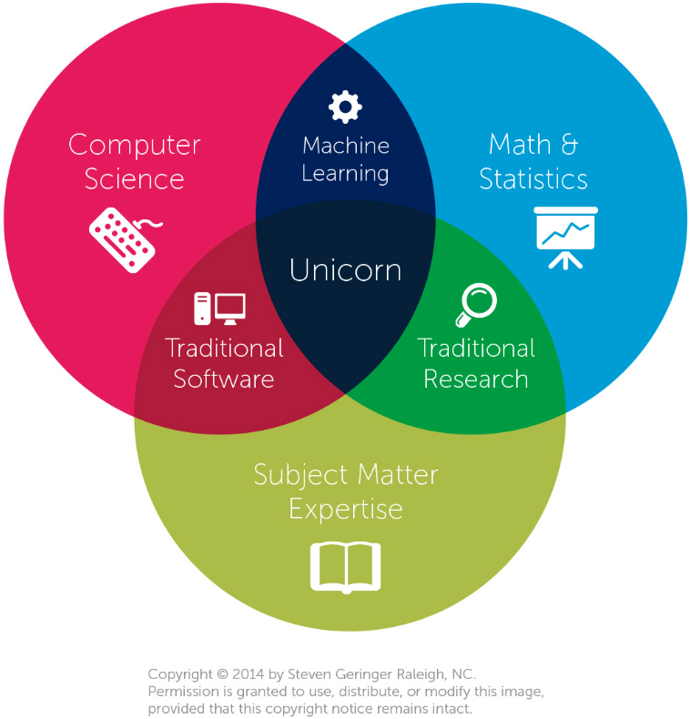

class: middle, center, title-slide

# Big data project

Introduction

---

# Data science

.center.width-70[]

---

# Your superpower?

- Answering *business* or *scientific questions* with **data**.
- This process involves several steps:
    - Understanding and formalizing the problem
    - Defining a model
    - Collecting, cleaning and storing data
    - Choosing a technology
    - Analyzing the results
    - Storytelling and visualization
    - Iterate
- In this project, we will ask you an (open) question and you will go through all these steps to form an answer.

---

# Understanding and formalizing

- What is it that I really want to answer?
- Why do I want an answer to this question?
- Do I understand the problem?

---

# Defining a model

- How do I answer?
- What are my assumptions?
- What statistical model do I consider?
- What algorithm shall I use?

---

# Collecting, cleaning and storing data

- What data do I need for fitting my model?
- How large this data should be?
- Where do I collect this data?
- Is data cleaning necessary?
- How do I store the data?

---

# Choosing a technology

- What tools do I need?
- What technology shall I use?
- Is a laptop enough, or shall I use a large-scale distributed system?
- How do I make my analysis reproducible?

---

# Analyzing the results

- How do I analyze the results of the model?
- How do I assess the significance of the results?
- To what do I compare?
- What are the conclusions?
- Is this convincing?
- Does this corroborate with previous studies?

---

# Storytelling and visualization

- How do I present my results?
- How do I make interpretable visualizations?
- How do I present my results to a non-technical audience?

---

# Iterate

- Is this conclusive?
- Am I going in the right direction?
- Shall I go back and define a new model?
- ... or collect new or more data?
- ... or use other tools?

---

class: middle, center

# Your project this year

---

class: middle, center

.project-question[Does sunshine make us happy?]

---

class: middle, center

# Organization

---

# Activities

- Teams of *3 students*.
- Monthly **project reviews** of the progress.
    - Oral presentation
        - 10mn
        - Q&A
        - Round-robin designated speaker
    - Short report
        - 4 pages max
    - Feedback on technical progress and project management.
- *Seminars* by local and external speakers.
    - Topics: big data, data science, visualization, communication, domain-specific presentations, etc.
    - Presence at the seminars and intermediate reviews is **mandatory**.
- Writing of a **final report**.
- Defense of the *project*.

---

# Schedule

- 30/10: Presentation of the project
- 20/11: Review 1: Explain your objectives and roadmap
- 11/12: Review 2
- 19/02: Review 3
- 19/03: Review 4
- 16/04: Review 5
- 14/05: Final report and defenses

Seminars will be announced later.

---

# Evaluation

The evaluation will be based on:
- the intermediate review meetings (progress achieved, quality of project management) (*30%*)
- the quality of the final report (*15%*)
- the quality of the final oral defense (*15%*)
- the overall solution (*40%*)
    - the originality, methodology, clarity, reproducibility and technological choices of the solution will be mainly assessed.    

---

class: middle, center

# Brainstorming
